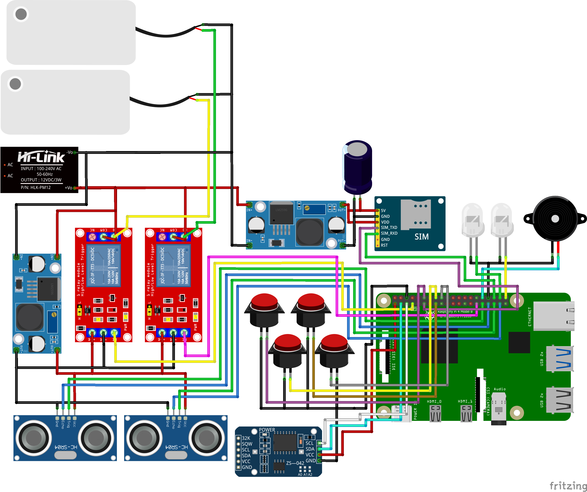

# Smart-Sprayer

## Overview

The Smart-Sprayer is an advanced IoT-enabled agricultural device built on the ESP32 microcontroller platform. It is designed to revolutionize precision farming by providing intelligent pesticide spraying capabilities. The system integrates ultrasonic sensors for container level monitoring, GSM communication for remote monitoring, LCD display for local status indication, relay-controlled actuators for spray mechanism operation, WiFi connectivity for cloud integration, and Firebase for real-time data synchronization and remote control.

## Features

### Core Functionality
- **Container Level Monitoring**: Ultrasonic sensor-based measurement of pesticide container fill percentage
- **Remote Monitoring**: GSM module integration for SMS notifications and status updates
- **Local Display**: 20x4 LCD screen for real-time system status and information display
- **Actuator Control**: Dual relay system for controlling spray pumps and valves
- **Serial Interface**: Command-line interface for system testing and configuration

### Advanced Features
- **Cloud Connectivity**: Firebase Realtime Database integration for data logging and remote control
- **WiFi Management**: Automatic WiFi configuration with captive portal fallback
- **Time Synchronization**: NTP integration for accurate timestamping of data
- **Precision Spraying**: Distance-based spray control to avoid over-spraying
- **Network Connectivity**: Real-time network status monitoring across multiple protocols
- **Bulk Messaging**: SMS broadcasting to multiple recipients
- **Real-time Streaming**: Firebase streams for live control and monitoring
- **Weather Integration**: WeatherAPI for current weather monitoring to prevent spraying during rain
- **Smart Scheduling**: Dual-pump scheduling with weather-based postponement and SMS notifications
- **Commercial Feedback**: Professional LED blinking patterns and industrial buzzer tones for status indication
- **Network Resilience**: Automatic GSM reconnection and SMS retry mechanisms
- **Event Notifications**: SMS alerts for spraying completion, postponement, and system errors
- **Modular Design**: Separate configuration headers for easy maintenance and updates

### Notification System
The Smart-Sprayer includes a comprehensive notification system for operational awareness:

- **SMS Alerts**: Automatic notifications for spraying events (completion, postponement, errors)
- **Retry Logic**: Failed SMS messages are automatically retried up to 3 times
- **Network Monitoring**: GSM network disconnection triggers automatic reconnection attempts
- **Commercial Feedback**: Professional LED blinking patterns and industrial buzzer tones
- **Status Indicators**: Visual and audible feedback for all system operations

### Container Level Calculation
The ultrasonic sensor measures the distance from the sensor to the surface of the pesticide in the container. To calculate the fill percentage:

1. Define a variable for the total height of the container (e.g., `CONTAINER_HEIGHT` in cm)
2. Measure the distance from the sensor to the liquid surface using the SR04 sensor
3. Calculate the filled height: `filledHeight = CONTAINER_HEIGHT - measuredDistance`
4. Calculate the percentage: `percentage = (filledHeight / CONTAINER_HEIGHT) * 100`

This allows precise monitoring of pesticide levels to prevent running out during spraying operations.

## Hardware Requirements

### Microcontroller
- ESP32 development board (ESP32-WROOM-32 recommended) with built-in WiFi and Bluetooth

### Sensors and Modules
- HC-SR04 ultrasonic distance sensor (2 units)
- 20x4 I2C LCD display module
- GSM module (SIM800L or compatible)
- 2-channel relay module (5V or 12V based on application)
- Buzzer module (active/passive buzzer)
- LED indicators (2 units: OK and Error status)
- DS1302 RTC module (for accurate timekeeping)
- Push buttons (4 units: WiFi reset + 3 for menu navigation)

### Additional Components
- SIM card for GSM module
- Power supply (5V for ESP32, appropriate voltage for relays)
- Jumper wires and breadboard for prototyping
- Antenna for GSM module
- Internet connection for WiFi and Firebase functionality

### Pin Configuration
The system uses centralized pin definitions in `PINS_CONFIG.h` for easy modification:

| Component | Pin | Function | Notes |
|-----------|-----|----------|-------|
| Ultrasonic Sensor 1 | GPIO 12 | Trig | Trigger pin for ultrasonic pulses |
| Ultrasonic Sensor 1 | GPIO 13 | Echo | Echo pin for distance measurement |
| Ultrasonic Sensor 2 | GPIO 14 | Trig | Trigger pin for second sensor |
| Ultrasonic Sensor 2 | GPIO 16 | Echo | Echo pin for second sensor |
| Relay Module | GPIO 4 | Relay 1 Control | Controls first spray actuator |
| Relay Module | GPIO 5 | Relay 2 Control | Controls second spray actuator |
| GSM Module | GPIO 10 | RX | Receive data from GSM module |
| GSM Module | GPIO 11 | TX | Transmit data to GSM module |
| LCD Display | GPIO 21 | SDA | I2C data line (default ESP32 I2C) |
| LCD Display | GPIO 22 | SCL | I2C clock line (default ESP32 I2C) |
| Buzzer | GPIO 17 | Control | Audio alert output |
| System OK LED | GPIO 18 | Status | Indicates system OK state |
| System Error LED | GPIO 19 | Status | Indicates system error state |
| WiFi Reset Button | GPIO 23 | Input | Triggers WiFi manager reset (hold 3s) |
| Menu Up Button | GPIO 25 | Input | Menu navigation up |
| Menu Down Button | GPIO 26 | Input | Menu navigation down |
| Menu Select Button | GPIO 27 | Input | Menu select/save |
| DS1302 CE | GPIO 32 | Output | RTC chip enable |
| DS1302 I/O | GPIO 33 | I/O | RTC data line |
| DS1302 CLK | GPIO 14 | Output | RTC serial clock |

## Software Requirements

### Development Environment
- Arduino IDE 1.8.19 or later
- ESP32 board support package for Arduino IDE

### Required Libraries
- `LiquidCrystal_I2C` (for LCD display control)
- `SoftwareSerial` (for GSM module communication)
- `WiFiManager` (for WiFi configuration)
- `Firebase_ESP_Client` (for Firebase integration)
- `NTPClient` (for time synchronization)
- `HTTPClient` (for weather API requests)
- `ArduinoJson` (for parsing weather API responses)
- `Time` (for time management)
- `TimeAlarms` (for scheduled alarms)
- `RtcDS1302` (for DS1302 RTC module)

### Installation Steps
1. Install Arduino IDE from the official website
2. Add ESP32 board support:
   - Open Arduino IDE
   - Go to File > Preferences
   - Add `https://dl.espressif.com/dl/package_esp32_index.json` to Additional Board Manager URLs
   - Tools > Board > Boards Manager > Search for ESP32 > Install
3. Install required libraries:
   - Sketch > Include Library > Manage Libraries
   - Search and install the required libraries listed above

### Firebase Credentials Setup
1. Copy `source/esp32/SmartSprayer/FIREBASE_CREDENTIALS_template.h` to `source/esp32/SmartSprayer/FIREBASE_CREDENTIALS.h`
2. Fill in your Firebase project credentials:
   - WiFi SSID and password
   - Firebase API key and database URL
   - Service account credentials
   - User credentials (optional)
3. The `FIREBASE_CREDENTIALS.h` file is ignored by git to protect sensitive information

### GSM Recipients Setup
1. Copy `source/esp32/SmartSprayer/GSM_RECIPIENTS_template.h` to `source/esp32/SmartSprayer/GSM_RECIPIENTS.h`
2. Add your phone numbers to the recipients array
3. Set the `numRecipients` variable to the number of active recipients
4. The `GSM_RECIPIENTS.h` file is ignored by git to protect phone numbers

### Weather Credentials Setup
1. Copy `source/esp32/SmartSprayer/WEATHER_CREDENTIALS_template.h` to `source/esp32/SmartSprayer/WEATHER_CREDENTIALS.h`
2. Fill in your WeatherAPI credentials:
   - API key from https://www.weatherapi.com/
   - Location (e.g., "Manila" or city name)
3. The `WEATHER_CREDENTIALS.h` file is ignored by git to protect your API key

#### WeatherAPI Sample Call and Response
The system uses WeatherAPI for current weather monitoring. Here's a sample API call and response:

**API Call:**
```
GET https://api.weatherapi.com/v1/current.json?key=64812e322c3f4b42af7135146252012&q=Manila&aqi=no
```

**Sample Response:**
```json
{
    "location": {
        "name": "Manila",
        "region": "Manila",
        "country": "Philippines",
        "lat": 14.6042,
        "lon": 120.9822,
        "tz_id": "Asia/Manila",
        "localtime_epoch": 1766239111,
        "localtime": "2025-12-20 21:58"
    },
    "current": {
        "last_updated_epoch": 1766238300,
        "last_updated": "2025-12-20 21:45",
        "temp_c": 26.1,
        "temp_f": 79.0,
        "is_day": 0,
        "condition": {
            "text": "Partly cloudy",
            "icon": "//cdn.weatherapi.com/weather/64x64/night/116.png",
            "code": 1003
        },
        "wind_mph": 4.5,
        "wind_kph": 7.2,
        "wind_degree": 56,
        "wind_dir": "ENE",
        "pressure_mb": 1011.0,
        "pressure_in": 29.85,
        "precip_mm": 0.0,
        "precip_in": 0.0,
        "humidity": 84,
        "cloud": 75,
        "feelslike_c": 28.5,
        "feelslike_f": 83.4,
        "windchill_c": 25.2,
        "windchill_f": 77.3,
        "heatindex_c": 27.2,
        "heatindex_f": 81.0,
        "dewpoint_c": 21.1,
        "dewpoint_f": 70.0,
        "vis_km": 10.0,
        "vis_miles": 6.0,
        "uv": 0.0,
        "gust_mph": 6.6,
        "gust_kph": 10.6
    }
}
```

The system checks `current.precip_mm` and `current.condition.text` to determine if it's raining.

### Security Note
- Never commit `FIREBASE_CREDENTIALS.h`, `GSM_RECIPIENTS.h`, or `WEATHER_CREDENTIALS.h` to version control
- Use the provided templates to create your configuration files
- Regularly rotate API keys, passwords, and phone numbers
- Use Firebase security rules to protect your database

## Installation and Setup

### Repository Setup
```bash
git clone https://github.com/qppd/Smart-Sprayer.git
cd Smart-Sprayer
```

### Hardware Assembly

#### Wiring Diagrams
Refer to the wiring diagrams in the `wiring/` directory for complete circuit connections:
- [Smart-Sprayer.fzz](wiring/Smart-Sprayer.fzz) - Fritzing diagram file
- 

#### Assembly Instructions
1. Connect the ultrasonic sensor to GPIO 12 (Trig) and GPIO 13 (Echo)
2. Wire the relay module to GPIO 4 and GPIO 5
3. Connect GSM module to GPIO 10 (RX) and GPIO 11 (TX)
4. Attach the I2C LCD to the default I2C pins (GPIO 21 SDA, GPIO 22 SCL)
5. Connect the WiFi reset button to GPIO 23 (with pull-up resistor)
6. Connect menu navigation buttons: Up to GPIO 25, Down to GPIO 26, Select to GPIO 27
7. Connect DS1302 RTC: CE to GPIO 32, I/O to GPIO 33, CLK to GPIO 14
8. Insert SIM card into GSM module and attach antenna
9. Power the system with appropriate voltage sources

### Software Upload
1. Open `source/esp32/SmartSprayer/SmartSprayer.ino` in Arduino IDE
2. Select ESP32 Dev Module from Tools > Board
3. Choose the correct COM port
4. Click Upload to flash the firmware

## Usage

### Basic Operation
1. Power on the ESP32 board
2. The system will initialize all modules automatically
3. LCD will display initialization status
4. System is ready for operation

### WiFi Manager Reset
- Hold the WiFi reset button (GPIO 23) for 3 seconds during boot to enter WiFi manager AP mode
- This allows reconfiguration of WiFi credentials without reprogramming the device

### LCD Menu System
The system includes an interactive LCD menu controlled by 3 navigation buttons:
- **Menu Up Button (GPIO 25)**: Navigate up in menus or increment values
- **Menu Down Button (GPIO 26)**: Navigate down in menus or decrement values  
- **Menu Select Button (GPIO 27)**: Select menu items or save settings

#### Menu Options:
1. **Schedule Spray**: Set daily spray time (hour and minute)
2. **Cancel Schedule**: Remove existing spray schedule
3. **View Time**: Display current time from RTC

### Serial Command Interface
The system provides a comprehensive serial command interface for testing and configuration. Connect to the ESP32 using Arduino Serial Monitor at 9600 baud rate.

#### Available Commands

##### Relay Control
- `operate-relay1_on`: Activates relay 1 (turns spray pump/valve on)
- `operate-relay1_off`: Deactivates relay 1 (turns spray pump/valve off)
- `operate-relay2_on`: Activates relay 2 (turns spray pump/valve on)
- `operate-relay2_off`: Deactivates relay 2 (turns spray pump/valve off)

##### GSM Communication
- `send-sms`: Sends a test SMS message to the default number
- `send-sms-to-all`: Broadcasts SMS to all configured recipients
- `check-network`: Queries GSM network registration status

##### Sensor Reading
- `get-distance1`: Retrieves current distance measurement from ultrasonic sensor 1 (container level)
- `get-distance2`: Retrieves current distance measurement from ultrasonic sensor 2
- `get-level`: Calculates and displays container fill level and percentage

##### Display Testing
- `test-display`: Displays test information on the LCD screen

##### Buzzer Control
- `buzzer-on`: Turns buzzer on continuously
- `buzzer-off`: Turns buzzer off
- `buzzer-beep`: Produces a short beep

##### LED Control
- `led-ok`: Turns on system OK LED
- `led-error`: Turns on system error LED
- `led-warning`: Turns on both LEDs for warning
- `led-clear`: Turns off all system LEDs
- `set-leds`: Manually set LED states (OK and Error)

##### Notification Testing
- `test-alert`: Triggers commercial alert pattern (LEDs + buzzer)
- `test-success`: Triggers commercial success pattern (LEDs + buzzer)
- `test-error`: Triggers commercial error pattern (LEDs + buzzer)
- `test-network`: Tests GSM network connection and reconnection

##### Weather Monitoring
- `check-weather`: Fetches current weather and checks for rain

##### LCD Control
- `clear-lcd`: Clears the LCD display
- `test-lcd`: Displays test messages on the LCD

##### NTP Time Functions
- `get-time`: Retrieves and displays current formatted date/time
- `get-timestamp`: Gets current NTP timestamp
- `get-timestamp-fallback`: Gets NTP timestamp with fallback
- `get-log-prefix`: Gets formatted log prefix with timestamp
- `get-datetime-fallback`: Gets formatted date/time with fallback
- `check-ntp`: Checks if NTP time is synchronized
- `update-ntp`: Manually updates NTP date/time

##### WiFi Management
- `wifi-reset`: Resets WiFi settings and restarts in AP mode

##### Button Testing
- `button-status`: Checks if the WiFi reset button is currently pressed

### Command Usage Examples
```
operate-relay1_on
Relay 1 turned ON

get-distance1
Distance 1: 45 cm

get-level
Distance: 45 cm, Filled: 55 cm, Percentage: 55 %

test-display
LCD test displayed

get-time
Current time: 2025-12-20 14:30:25

check-weather
Weather check: No rain currently - safe to spray

clear-lcd
LCD cleared

wifi-reset
Resetting WiFi settings...
```


## API Reference

### LCD Functions (LCD_CONFIG.h)
- `void initLCD()`: Initializes the LCD display
- `void clearLCD()`: Clears the LCD screen
- `void setLCDText(String text, int x, int y)`: Displays text at specified coordinates
- `void setLCDText(double value, int x, int y)`: Displays numeric value at coordinates
- `void setLCDText(float value, int x, int y)`: Displays float value at coordinates
- `void setLCDText(int value, int x, int y)`: Displays integer value at coordinates
- `void setLCDText(char text, int x, int y)`: Displays character at coordinates

### PIN Configuration (PINS_CONFIG.h)
- Centralized pin definitions for all hardware components
- Easy to modify pin assignments without changing multiple files

### Buzzer Functions (BUZZER_CONFIG.h)
- `void initBuzzer()`: Initializes buzzer pin
- `void buzzerOn()`: Turns buzzer on continuously
- `void buzzerOff()`: Turns buzzer off
- `void buzzerBeep(int duration_ms)`: Produces a beep for specified duration

### LED Functions (LED_CONFIG.h)
- `void initLEDs()`: Initializes LED pins
- `void setSystemOK()`: Turns on OK LED, off error LED
- `void setSystemError()`: Turns on error LED, off OK LED
- `void setSystemWarning()`: Turns on both LEDs
- `void clearSystemLEDs()`: Turns off both LEDs

### Button Functions (BUTTON_CONFIG.h)
- `void initBUTTONS()`: Initializes all 4 buttons with pull-up resistors
- `void setInputFlags()`: Reads and debounces button states
- `void resolveInputFlags()`: Processes button presses and calls appropriate actions
- `void inputAction(int buttonIndex)`: Handles button press actions (WiFi reset, menu navigation)
- `void enterSchedulingMode()`: Activates spray scheduling interface
- `void exitSchedulingMode()`: Returns to main menu
- `void scheduleSprayAlarm(int hour, int minute)`: Sets daily spray alarm
- `void cancelSprayAlarm()`: Removes existing spray alarm

### RTC Functions (RTC_CONFIG.h)
- `void initRTC()`: Initializes DS1302 RTC module and syncs with system time
- `void syncRTCWithNTP()`: Synchronizes RTC with NTP time (called once during setup)
- `bool isRTCValid()`: Checks if RTC time is valid
- `String getRTCDateTimeString()`: Returns formatted RTC date/time string
- `void updateSystemTimeFromRTC()`: Updates system time from RTC

### GSM Functions (GSM_CONFIG.h)
- `void initGSM()`: Initializes GSM module communication
- `void sendSMS(String number, String message)`: Sends SMS to specified number
- `void sendSMSToAll(String message)`: Sends SMS to all configured numbers
- `void checkNetwork()`: Checks GSM network registration status

### Relay Functions (RELAY_CONFIG.h)
- `void initRELAY()`: Sets up relay control pins
- `void operateRELAY(uint16_t RELAY, boolean OPENED)`: Controls relay state

### Ultrasonic Functions (SR04_CONFIG.h)
- `void initSR04()`: Initializes ultrasonic sensor pins
- `long readDistance()`: Returns distance measurement in centimeters from sensor 1 (used for container level monitoring)
- `long readDistance2()`: Returns distance measurement in centimeters from sensor 2
- `float calculateFillLevel(long distance)`: Calculates filled height in container (container height - distance)
- `float calculateFillPercentage(long distance)`: Calculates fill percentage (0-100%)

### WiFi Functions (WIFI_CONFIG.h)
- `void initWIFI()`: Initializes WiFi connection with auto-configuration portal

### Firebase Functions (FIREBASE_CONFIG.h)
- `void initFIREBASE()`: Initializes Firebase connection and streams
- `void updateDeviceCurrent(...)`: Updates current device state in Firebase
- `void logDeviceData(...)`: Logs device data with timestamp
- `void sendSmartSprayerData(...)`: Sends Smart Sprayer data to Firebase
- `void sendMessage(...)`: Sends FCM notification
- `void sendMessageToAll(...)`: Sends FCM to all registered devices
- `void handleStreams()`: Processes Firebase real-time streams
- `bool isReady()`: Checks Firebase connection status

### NTP Functions (NTP_CONFIG.h)
- `void initNTP()`: Initializes NTP time synchronization
- `void getNTPDate()`: Retrieves and formats current date/time
- `unsigned long getNTPTimestamp()`: Gets Unix timestamp from NTP
- `unsigned long getNTPTimestampWithFallback()`: NTP timestamp with automatic fallback
- `bool isNTPSynced()`: Checks if NTP time is synchronized
- `String getFormattedDateTime()`: Returns formatted date/time string
- `String getFormattedDateTimeWithFallback()`: Formatted time with fallback indication
- `String getCurrentLogPrefix()`: Provides timestamp prefix for logging

### Weather Functions (WEATHER_CONFIG.h)
- `bool checkWeatherForRain()`: Fetches current weather and returns true if it's raining

## Project Structure

```
Smart-Sprayer/
├── .gitignore
├── LICENSE
├── README.md
├── FIREBASE_CREDENTIALS_template.h
├── diagram/
│   └── [circuit diagrams and schematics]
├── model/
│   └── [AI/ML models for spray optimization]
├── source/
│   └── esp32/
│       └── SmartSprayer/
│           ├── SmartSprayer.ino
│           ├── PINS_CONFIG.h
│           ├── PINS_CONFIG.h
│           ├── LCD_CONFIG.h
│           ├── GSM_CONFIG.h
│           ├── GSM_RECIPIENTS.h (ignored)
│           ├── GSM_RECIPIENTS_template.h
│           ├── RELAY_CONFIG.h
│           ├── SR04_CONFIG.h
│           ├── WIFI_CONFIG.h
│           ├── FIREBASE_CONFIG.h
│           ├── NTP_CONFIG.h
│           ├── WEATHER_CONFIG.h
│           ├── BUZZER_CONFIG.h
│           ├── LED_CONFIG.h
│           ├── BUTTON_CONFIG.h
│           ├── RTC_CONFIG.h
│           ├── WEATHER_CREDENTIALS.h (ignored)
│           ├── WEATHER_CREDENTIALS_template.h
│           ├── FIREBASE_CREDENTIALS.h (ignored)
│           └── FIREBASE_CREDENTIALS_template.h
└── wiring/
    └── [wiring diagrams and instructions]
```

## Configuration

### GSM Module Configuration
Edit `GSM_CONFIG.h` to modify:
- Phone numbers for SMS recipients
- GSM module pins (if different from defaults)
- Communication baud rate

### LCD Configuration
Modify LCD parameters in `LCD_CONFIG.h`:
- I2C address (default: 0x27)
- Display dimensions (default: 20x4)

### Relay Configuration
Adjust relay settings in `RELAY_CONFIG.h`:
- GPIO pins for relays
- Relay logic (active high/low)

### Ultrasonic Sensor Configuration
Configure sensor parameters in `SR04_CONFIG.h`:
- Trigger and echo pins
- Measurement timing parameters

### Button Configuration
Configure WiFi reset button settings in `BUTTON_CONFIG.h`:
- Button pin assignment
- Debounce delay
- Hold time for WiFi reset trigger

## Troubleshooting

### Common Issues

#### ESP32 Not Detected
- Ensure correct COM port selection in Arduino IDE
- Check USB cable and drivers
- Try different USB port

#### LCD Not Displaying
- Verify I2C connections and address
- Check power supply to LCD
- Confirm I2C pins (SDA: GPIO 21, SCL: GPIO 22)

#### GSM Not Responding
- Check SIM card insertion and PIN status
- Verify antenna connection
- Ensure sufficient signal strength
- Check GSM module power supply

#### Ultrasonic Sensor Inaccurate Readings
- Ensure clear line of sight for sensor
- Check voltage levels (5V required)
- Verify pin connections
- Test with known distances

#### Relay Not Activating
- Confirm relay module power supply
- Check GPIO pin assignments
- Verify relay logic (normally open/closed)

#### Weather API Issues
- Ensure valid OpenWeatherMap API key in `WEATHER_CREDENTIALS.h`
- Check WiFi connection for API requests
- Verify location format (e.g., "Manila,PH")
- Monitor serial output for API error codes

### Debug Mode
Enable serial debugging by monitoring the Serial output at 9600 baud. The system provides detailed status messages during initialization and operation.

## Contributing

We welcome contributions to the Smart-Sprayer project. Please follow these guidelines:

1. Fork the repository
2. Create a feature branch (`git checkout -b feature/AmazingFeature`)
3. Commit your changes (`git commit -m 'Add some AmazingFeature'`)
4. Push to the branch (`git push origin feature/AmazingFeature`)
5. Open a Pull Request

### Development Guidelines
- Maintain modular code structure
- Add comments for complex logic
- Test all changes thoroughly
- Update documentation for new features
- Follow Arduino coding standards

## License

This project is licensed under the terms specified in the LICENSE file. See LICENSE for details.

## Acknowledgments

- ESP32 community for microcontroller support
- Arduino framework developers
- Open-source library contributors

## Contact

For questions, issues, or contributions, please use the GitHub repository's issue tracker or pull request system.

## Version History

- v1.1.0: Added weather integration for rain detection
  - OpenWeatherMap API integration
  - Weather-based spray control
  - New serial command for weather checking
- v1.0.0: Initial release with basic functionality
  - Ultrasonic distance measurement
  - GSM SMS communication
  - LCD status display
  - Relay control system
  - Serial command interface

## Future Enhancements

- Integration with GPS for location tracking
- Machine learning models for spray optimization
- Mobile app for remote control
- Data logging and analytics
- Battery management system

## Contact

- Email: [quezon.province.pd@gmail.com](mailto:quezon.province.pd@gmail.com)
- GitHub: [github.com/qppd](https://github.com/qppd)
- Portfolio: [sajed-mendoza.onrender.com](https://sajed-mendoza.onrender.com)
- Facebook: [facebook.com/qppd.dev](https://facebook.com/qppd.dev)
- Facebook Page: [facebook.com/QUEZONPROVINCEDEVS](https://facebook.com/QUEZONPROVINCEDEVS)

## Author

Created by qppd

## GitHub Repository

This project is hosted on GitHub at: https://github.com/qppd/Smart-Sprayer