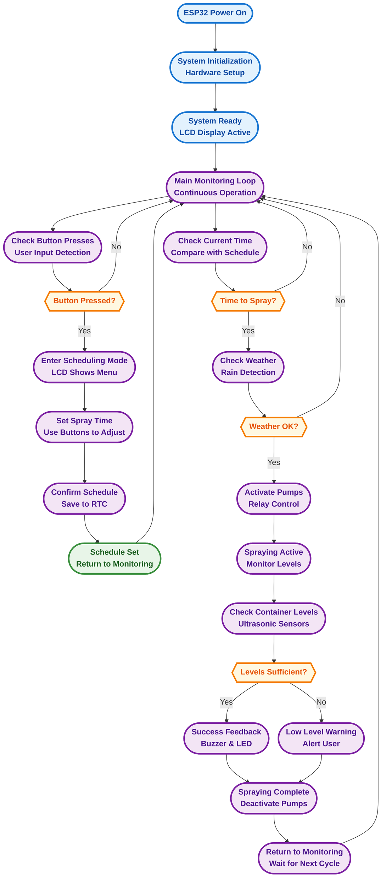

# Smart-Sprayer System Flowchart

## Flowchart Legend

### **System Startup (Blue)**
- ESP32 powers on and initializes all hardware components
- System becomes ready with active LCD display

### **Main Monitoring (Purple)**
- Continuous loop checking for user input and scheduled events
- Monitors time and weather conditions for spraying decisions

### **Scheduling Process (Purple)**
- User enters scheduling mode via button press
- Sets desired spray time using ESP32 buttons
- Confirms and saves schedule to RTC module

### **Automated Spraying (Purple)**
- System checks if scheduled time matches current time
- Verifies weather conditions before activation
- Activates pumps and monitors spraying process
- Provides feedback and handles completion

### **Decision Points (Orange)**
- Button press detection for user interaction
- Time matching for scheduled spraying
- Weather condition validation
- Container level monitoring

### **Key Features**
1. **Button-Based Scheduling**: Easy time setting using ESP32 buttons
2. **Weather-Aware Operation**: Automatic rain detection and postponement
3. **Level Monitoring**: Real-time container level checking during spraying
4. **User Feedback**: Audio-visual indicators for system status
5. **Automated Cycling**: Continuous monitoring and scheduled operation

This flowchart represents the complete operational process of the Smart-Sprayer system, from initial setup through automated spraying cycles, with user scheduling via ESP32 buttons as the primary interaction method.