# Smart-Sprayer System Flowchart

```mermaid
flowchart TD
    %% Start
    START(["🚀 ESP32 Power On"])

    %% Setup Phase
    subgraph SETUP_PHASE["System Initialization"]
        SETUP(["⚙️ Setup Function"])
        SERIAL_INIT(["📡 Serial.begin(9600)"])
        LCD_INIT(["🖥️ initLCD()"])
        GSM_INIT(["📱 initGSM()"])
        RELAY_INIT(["🔌 initRELAY()"])
        SR04_INIT(["📏 initSR04()"])
        WIFI_INIT(["🌐 initWIFI()"])
        FIREBASE_INIT(["☁️ initFIREBASE()"])
        NTP_INIT(["⏰ initNTP()"])
        BUZZER_INIT(["🔊 initBuzzer()"])
        LED_INIT(["💡 initLEDs()"])
        BUTTON_INIT(["🔘 initBUTTONS()"])
        RTC_INIT(["🕐 initRTC()"])
        SYNC_RTC(["🔄 syncRTCWithNTP()"])
    end

    %% Main Loop
    subgraph MAIN_LOOP["Continuous Operation"]
        LOOP(["🔄 Main Loop"])
        SET_FLAGS(["📝 setInputFlags()"])
        RESOLVE_FLAGS(["🔧 resolveInputFlags()"])
        ALARM_DELAY(["⏳ Alarm.delay(10)"])
        SERIAL_CHECK{"📨 Serial.available()?"}
    end

    %% Serial Command Processing
    subgraph CMD_PROCESS["Command Processing"]
        READ_COMMAND(["📖 Read Serial Command"])
        TRIM_COMMAND(["✂️ command.trim()"])
        COMMAND_DECISION{"🎯 Command Type"}

        subgraph RELAY_CMDS["Relay Control"]
            RELAY1_ON(["🔌 Relay 1 ON<br/>Pump 1 Activate"])
            RELAY1_OFF(["🔌 Relay 1 OFF<br/>Pump 1 Deactivate"])
            RELAY2_ON(["🔌 Relay 2 ON<br/>Pump 2 Activate"])
            RELAY2_OFF(["🔌 Relay 2 OFF<br/>Pump 2 Deactivate"])
        end

        subgraph GSM_CMDS["GSM & SMS"]
            SEND_SMS(["📱 Send SMS<br/>Test Message"])
            SEND_SMS_ALL(["📱 Send to All<br/>Bulk SMS"])
            CHECK_NETWORK(["📡 Network Check<br/>Connection Status"])
        end

        subgraph SENSOR_CMDS["Sensors"]
            GET_DISTANCE1(["📏 Distance 1<br/>Ultrasonic Reading"])
            GET_DISTANCE2(["📏 Distance 2<br/>Ultrasonic Reading"])
            GET_LEVEL(["📊 Level Calculation<br/>Percentage & Status"])
        end

        subgraph AUDIO_CMDS["Audio Feedback"]
            BUZZER_ON(["🔊 Buzzer ON<br/>Continuous Tone"])
            BUZZER_OFF(["🔇 Buzzer OFF<br/>Silence"])
            BUZZER_BEEP(["🔔 Buzzer Beep<br/>Short Tone"])
        end

        subgraph VISUAL_CMDS["Visual Feedback"]
            LED_OK(["✅ System OK<br/>Green LED"])
            LED_ERROR(["❌ System Error<br/>Red LED"])
            LED_WARNING(["⚠️ System Warning<br/>Yellow LEDs"])
            LED_CLEAR(["🧹 Clear LEDs<br/>All Off"])
            SET_LEDS(["🎛️ Set LEDs<br/>Manual Control"])
        end

        subgraph TEST_CMDS["System Tests"]
            TEST_ALERT(["🚨 Alert Pattern<br/>Commercial Alert"])
            TEST_SUCCESS(["🎉 Success Pattern<br/>Completion Tone"])
            TEST_ERROR(["💥 Error Pattern<br/>Failure Alert"])
            TEST_NETWORK(["🌐 Network Test<br/>Reconnect Check"])
        end

        subgraph WEATHER_CMDS["Weather"]
            CHECK_WEATHER(["🌦️ Weather Check<br/>Rain Detection"])
            WEATHER_RAIN{{"🌧️ Rain Expected?"}}
            WEATHER_RAIN_MSG(["🌧️ Rain Alert<br/>Postpone Spraying"])
            WEATHER_CLEAR_MSG(["☀️ Clear Weather<br/>Safe to Spray"])
        end

        subgraph LCD_CMDS["Display"]
            CLEAR_LCD(["🧹 Clear LCD<br/>Reset Display"])
            TEST_LCD(["🖥️ Test LCD<br/>Display Patterns"])
        end

        subgraph TIME_CMDS["Time Management"]
            GET_TIME(["🕐 Current Time<br/>Formatted Display"])
            GET_TIMESTAMP(["⏱️ NTP Timestamp<br/>Unix Time"])
            GET_TS_FALLBACK(["⏱️ Timestamp Fallback<br/>RTC Backup"])
            GET_LOG_PREFIX(["📝 Log Prefix<br/>Timestamp Format"])
            GET_DT_FALLBACK(["🕐 DateTime Fallback<br/>RTC Backup"])
            CHECK_NTP(["🔗 NTP Sync Status<br/>Synchronization"])
            UPDATE_NTP(["🔄 Update NTP<br/>Force Sync"])
        end

        subgraph SYSTEM_CMDS["System Control"]
            WIFI_RESET(["🔄 WiFi Reset<br/>Clear Settings"])
            BUTTON_STATUS(["🔘 Button Status<br/>Input Check"])
            UNKNOWN_CMD(["❓ Unknown Command<br/>Error Message"])
        end
    end

    %% Flow Connections
    START --> SETUP
    SETUP --> SERIAL_INIT
    SERIAL_INIT --> LCD_INIT
    LCD_INIT --> GSM_INIT
    GSM_INIT --> RELAY_INIT
    RELAY_INIT --> SR04_INIT
    SR04_INIT --> WIFI_INIT
    WIFI_INIT --> FIREBASE_INIT
    FIREBASE_INIT --> NTP_INIT
    NTP_INIT --> BUZZER_INIT
    BUZZER_INIT --> LED_INIT
    LED_INIT --> BUTTON_INIT
    BUTTON_INIT --> RTC_INIT
    RTC_INIT --> SYNC_RTC
    SYNC_RTC --> LOOP

    LOOP --> SET_FLAGS
    SET_FLAGS --> RESOLVE_FLAGS
    RESOLVE_FLAGS --> ALARM_DELAY
    ALARM_DELAY --> SERIAL_CHECK

    SERIAL_CHECK -->|No| LOOP
    SERIAL_CHECK -->|Yes| READ_COMMAND
    READ_COMMAND --> TRIM_COMMAND
    TRIM_COMMAND --> COMMAND_DECISION

    COMMAND_DECISION -->|operate-relay1_on| RELAY1_ON
    COMMAND_DECISION -->|operate-relay1_off| RELAY1_OFF
    COMMAND_DECISION -->|operate-relay2_on| RELAY2_ON
    COMMAND_DECISION -->|operate-relay2_off| RELAY2_OFF
    COMMAND_DECISION -->|send-sms| SEND_SMS
    COMMAND_DECISION -->|send-sms-to-all| SEND_SMS_ALL
    COMMAND_DECISION -->|check-network| CHECK_NETWORK
    COMMAND_DECISION -->|get-distance1| GET_DISTANCE1
    COMMAND_DECISION -->|get-distance2| GET_DISTANCE2
    COMMAND_DECISION -->|buzzer-on| BUZZER_ON
    COMMAND_DECISION -->|buzzer-off| BUZZER_OFF
    COMMAND_DECISION -->|buzzer-beep| BUZZER_BEEP
    COMMAND_DECISION -->|led-ok| LED_OK
    COMMAND_DECISION -->|led-error| LED_ERROR
    COMMAND_DECISION -->|led-warning| LED_WARNING
    COMMAND_DECISION -->|led-clear| LED_CLEAR
    COMMAND_DECISION -->|set-leds| SET_LEDS
    COMMAND_DECISION -->|test-alert| TEST_ALERT
    COMMAND_DECISION -->|test-success| TEST_SUCCESS
    COMMAND_DECISION -->|test-error| TEST_ERROR
    COMMAND_DECISION -->|test-network| TEST_NETWORK
    COMMAND_DECISION -->|check-weather| CHECK_WEATHER
    COMMAND_DECISION -->|clear-lcd| CLEAR_LCD
    COMMAND_DECISION -->|test-lcd| TEST_LCD
    COMMAND_DECISION -->|get-time| GET_TIME
    COMMAND_DECISION -->|get-timestamp| GET_TIMESTAMP
    COMMAND_DECISION -->|get-timestamp-fallback| GET_TS_FALLBACK
    COMMAND_DECISION -->|get-log-prefix| GET_LOG_PREFIX
    COMMAND_DECISION -->|get-datetime-fallback| GET_DT_FALLBACK
    COMMAND_DECISION -->|check-ntp| CHECK_NTP
    COMMAND_DECISION -->|update-ntp| UPDATE_NTP
    COMMAND_DECISION -->|wifi-reset| WIFI_RESET
    COMMAND_DECISION -->|button-status| BUTTON_STATUS
    COMMAND_DECISION -->|get-level| GET_LEVEL
    COMMAND_DECISION -->|Unknown| UNKNOWN_CMD

    CHECK_WEATHER --> WEATHER_RAIN
    WEATHER_RAIN -->|True| WEATHER_RAIN_MSG
    WEATHER_RAIN -->|False| WEATHER_CLEAR_MSG

    RELAY1_ON --> LOOP
    RELAY1_OFF --> LOOP
    RELAY2_ON --> LOOP
    RELAY2_OFF --> LOOP
    SEND_SMS --> LOOP
    SEND_SMS_ALL --> LOOP
    CHECK_NETWORK --> LOOP
    GET_DISTANCE1 --> LOOP
    GET_DISTANCE2 --> LOOP
    BUZZER_ON --> LOOP
    BUZZER_OFF --> LOOP
    BUZZER_BEEP --> LOOP
    LED_OK --> LOOP
    LED_ERROR --> LOOP
    LED_WARNING --> LOOP
    LED_CLEAR --> LOOP
    SET_LEDS --> LOOP
    TEST_ALERT --> LOOP
    TEST_SUCCESS --> LOOP
    TEST_ERROR --> LOOP
    TEST_NETWORK --> LOOP
    WEATHER_RAIN_MSG --> LOOP
    WEATHER_CLEAR_MSG --> LOOP
    CLEAR_LCD --> LOOP
    TEST_LCD --> LOOP
    GET_TIME --> LOOP
    GET_TIMESTAMP --> LOOP
    GET_TS_FALLBACK --> LOOP
    GET_LOG_PREFIX --> LOOP
    GET_DT_FALLBACK --> LOOP
    CHECK_NTP --> LOOP
    UPDATE_NTP --> LOOP
    WIFI_RESET --> LOOP
    BUTTON_STATUS --> LOOP
    GET_LEVEL --> LOOP
    UNKNOWN_CMD --> LOOP

    %% Styling
    classDef setupClass fill:#e3f2fd,stroke:#1976d2,stroke-width:3px,color:#0d47a1,font-weight:bold
    classDef loopClass fill:#f3e5f5,stroke:#7b1fa2,stroke-width:3px,color:#4a148c,font-weight:bold
    classDef commandClass fill:#e8f5e8,stroke:#388e3c,stroke-width:3px,color:#1b5e20,font-weight:bold
    classDef decisionClass fill:#fff8e1,stroke:#f57c00,stroke-width:3px,color:#e65100,font-weight:bold
    classDef subgraphClass fill:#fafafa,stroke:#616161,stroke-width:2px,color:#424242

    class SETUP,START setupClass
    class LOOP,SET_FLAGS,RESOLVE_FLAGS,ALARM_DELAY,SERIAL_CHECK loopClass
    class RELAY1_ON,RELAY1_OFF,RELAY2_ON,RELAY2_OFF,SEND_SMS,SEND_SMS_ALL,CHECK_NETWORK,GET_DISTANCE1,GET_DISTANCE2,BUZZER_ON,BUZZER_OFF,BUZZER_BEEP,LED_OK,LED_ERROR,LED_WARNING,LED_CLEAR,SET_LEDS,TEST_ALERT,TEST_SUCCESS,TEST_ERROR,TEST_NETWORK,WEATHER_RAIN_MSG,WEATHER_CLEAR_MSG,CLEAR_LCD,TEST_LCD,GET_TIME,GET_TIMESTAMP,GET_TS_FALLBACK,GET_LOG_PREFIX,GET_DT_FALLBACK,CHECK_NTP,UPDATE_NTP,WIFI_RESET,BUTTON_STATUS,GET_LEVEL,UNKNOWN_CMD commandClass
    class COMMAND_DECISION,WEATHER_RAIN decisionClass

    %% Subgraph styling
    classDef SETUP_PHASE subgraphClass
    classDef MAIN_LOOP subgraphClass
    classDef CMD_PROCESS subgraphClass
    classDef RELAY_CMDS,GSM_CMDS,SENSOR_CMDS,AUDIO_CMDS,VISUAL_CMDS,TEST_CMDS,WEATHER_CMDS,LCD_CMDS,TIME_CMDS,SYSTEM_CMDS subgraphClass
```

## Flowchart Legend

### **Setup Phase (Blue)**
- Initializes all system components in sequence
- Configures hardware interfaces and communication protocols
- Performs initial time synchronization

### **Main Loop (Purple)**
- Continuous operation cycle
- Handles button inputs and alarm triggers
- Processes serial commands when available

### **Command Processing (Green)**
- Extensive command set for system testing and control
- Covers all hardware components and system functions
- Provides immediate feedback for each command

### **Decision Points (Orange)**
- Command type routing
- Weather condition checking
- Serial data availability

### **Key System Features**
1. **Dual Relay Control**: Independent pump operation
2. **GSM Communication**: SMS notifications and network monitoring
3. **Ultrasonic Sensing**: Container level monitoring
4. **Audio/Visual Feedback**: Commercial-grade buzzer and LED patterns
5. **Weather Integration**: Rain detection and postponement logic
6. **Time Management**: NTP synchronization and RTC backup
7. **Button Interface**: 4-button menu navigation system
8. **Serial Diagnostics**: Comprehensive testing commands

This flowchart represents the complete operational flow of the Smart-Sprayer IoT system, from initialization through continuous operation and command processing.</content>
<parameter name="filePath">c:\Users\sajed\Desktop\PROJECTS\Smart-Sprayer\diagram\SmartSprayer_Flowchart.md